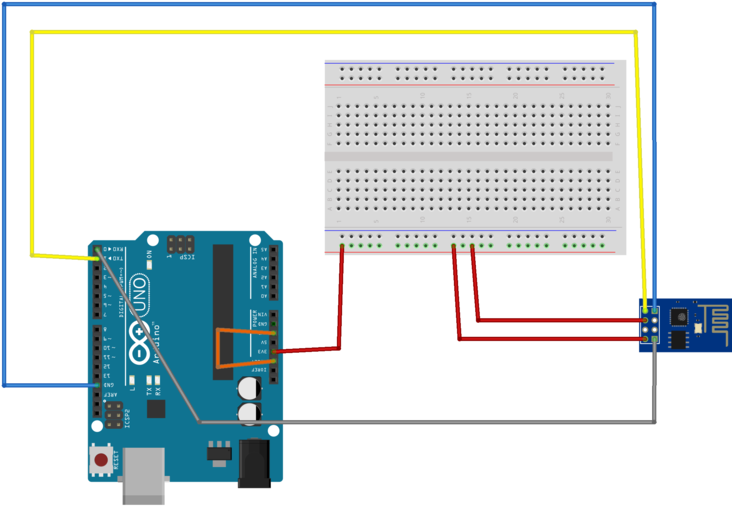
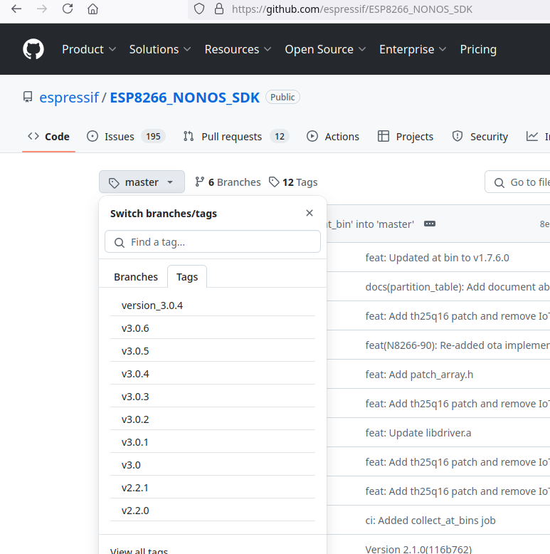

# Using an ESP-01 for WiFi on an Arduino UNO

The ESP-01, or ESP8266-01, is a minimalist ESP8266 device with just enough I/Os to use a a WiFi "shield" for an Arduino UNO.
It's not a shield in the traditional UNO sense as it doesn't stack nicely on top an UNO like other shields, and it's a 3.3V device, not a 5V device like most other devices in the UNO ecosystem.

The ESP-01 has a serial port (TX/RX pins) that can be used to communicate with the Arduino UNO.
The UNO has a single hardware serial port (the pins labelled TX/RX) that is shared with the USB port.  If the serial monitor is used in the Arduino IDE to read messages from the UNO, the hardware port can't be used to communicate with other devices.

Instead, the SoftwareSerial library can be used to communicate with the ESP-01. Any 2 GPIO pins on the UNO can be used as TX and RX lines.
Speed limit - ss is 57600.

The ESP-01 takes commands to connect to WiFi networks and transmit and receive data using AT commands sent over the serial port.  AT commands are short plain-text instructions that start with the string, AT.
AT commands to control the ESP-01 can be written directly to it on the serial port, but that requires knowledge of the command set and low level network communications.  It is much easier to use a pre-built library to do the work.
Two of those libraries are WiFiEsp and WiFiEspAT.
WiFiEspAT is the more modern and Arduino-like.
It requires version 1.7.4 or greater of the Espressif firmware.

The first task was to identify the firmware version running on my ESP-01.
An Arduino UNO was used to communicate with the ESP-01.
The connections were are follows:

| ESP-01 | Arduino UNO |
|:------:|:-----------:|
| 3V3    | 3V3         |
| RX     | RX          |
| RST    | NC          |
| IO0    | NC          |
| EN     | 3V3         |
| IO2    | NC          |
| TX     | TX          |
| GND    | GND         |

In addition, RESET on the Arduino was connected to GND.
This prevents the CPU on the UNO from starting and allows the UNO to be used as a basic USB-to serial converter.
The TX pin on the Arduino will send pulses to the ESP-01 at 5V.
The ESP-01 is 5V tolerant on the GPIO pins.
It is not tolerant on the power pins.
This comes from a reply to a facebook post in 2016 from Teo Swee Ann, the CEO of Espressif, the maker of the ESP8266.
https://www.facebook.com/groups/1499045113679103/permalink/1731855033731442/

See wiring diagram and photo.





The Arduino IDE was used to query the ESP-01:
Connect the UNO into a USB port on a PC.
Open the serial monitor in the IDE.
Set the baud rate to 115200 and line ending to "Both NL & CR".
Type "AT" into the console and wait for the "OK" response.  Type in capitals only.
Type "AT+GMR" and wait for the response.  An example is shown below.

```
01:02:11.439 -> ⸮^X⸮AT

01:02:14.082 -> 
01:02:14.082 -> OK
01:02:17.541 -> AT+GMR

01:02:17.541 -> AT version:0.40.0.0(Aug  8 2015 14:45:58)
01:02:17.541 -> SDK version:1.3.0
01:02:17.541 -> Ai-Thinker Technology Co.,Ltd.
01:02:17.541 -> Build:1.3.0.2 Sep 11 2015 11:48:04
01:02:17.575 -> OK
```

In this case, the firmware version is 0.40.0.0 from SDK 1.3.0.

An alternative method of finding the firmware version is to install the WiFiEspAT library and use the CheckFirmware sketch to find the version.

To upgrade to firmare 1.7.4, do the following:
1. Download the firmware from the Espressif github page
2. With the Arduino powered off, Connect GPIO0 to GND on the ESP-01, in addition to the wiring above.
3. Plug the Arduino into the PC
4. Check that we can communicate with the ESP-01
5. Flash the firmware
6. Power off the Arduino (unplug) and disconnect GPIO0 from GND on the ESP-01
7. Power the Arduino back on
8. Check the version

## Get the firmware:
Go to the
[Espressif GitHub page for ESP8266 firmware](https://github.com/espressif/ESP8266_NONOS_SDK "Espressif GitHub").
Select the 3.0.4 firmware branch by clicking on the 'master' dropdown, clicking on the 'Tags' menu, and selecting v3.0.4.



Download the following files:
1. boot_v1.7.bin
2. at/512+512/user1.1024.new.2.bin
3. blank.bin
4. esp_init_data_default_v08.bin

Alternatively, download a zip file containing the four files from here:
[./downloads/v1.7.4.zip](downloads/v1.7.4.zip)

Download the Espressif flash tool from
<https://docs.espressif.com/projects/esp-test-tools/en/latest/esp32/production_stage/tools/flash_download_tool.html>.
Click on the 'Flash Download Tool' link under 'Software' to get it.

Alternatively, get a local copy from here:
[./downloads/flash_tool.zip](downloads/v1.7.4.zip)

Run the flash tool and confirm that it can communicate with the ESP-01.  


Select the 'chipInfoDump' tab, select the device port, and click on the 'Chip Info' button.
If the communication is successful, the detection information will appear in the log window.

Select the 'SPIDownload' tab to flash the new firmware.
Set the SPI SPEED to 40Mhz
Set SPI MODE to QIO
Untick 'DoNotChgBin'

Flash in the following order:

|  File | Address |
|:------|-----------:|
| boot_v1.7.bin | 0x0 |
| at/512+512/user1.1024.new.2.bin | 0x01000 |
| blank.bin | 0xfb000 |
|esp_init_data_default_v08.bin | 0xfc000 |
| blank.bin | 0xfe000 |
| blank.bin | 0x7e000 |


The filenames and addresses come from README.md in the 'at' folder of the Espressif GitHub page.

A screenshot of the flashing in progess is here:


When the flashing is complete, the flash tool will print a status message:


The upgrade can be tested with the Arduino IDE.
Close the flash tool.
Unplug the Arduino from the PC.  Disconnect the cable from GPIO0 on the ESP-01 to GND.
Plug the Arduino back in.
Run the Arduino IDE and open the serial monitor.  Check the firmware version with AT commands.
An example of the output is shown below.

```
21:18:31.381 -> ?AT
21:18:36.490 -> 
21:18:36.490 -> OK
21:18:44.132 -> AT+GMR
21:18:44.132 -> AT version:1.7.4.0(May 11 2020 19:13:04)
21:18:44.132 -> SDK version:3.0.4(9532ceb)
21:18:44.132 -> compile time:May 27 2020 10:12:17
21:18:44.132 -> Bin version(Wroom 02):1.7.4
```

